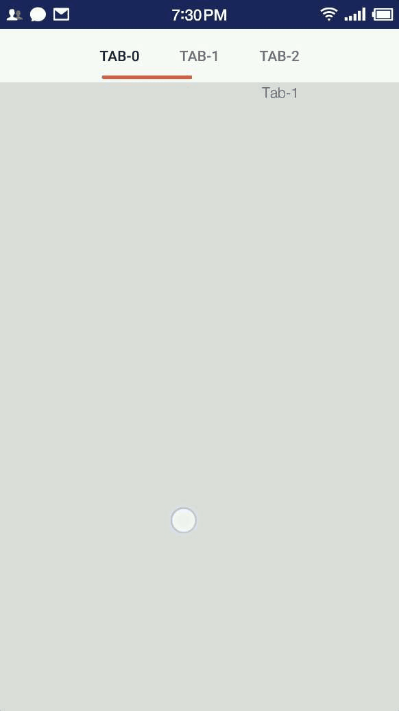

# tablayout-android

修改 support 包 TabLayout，实现新浪微博/即刻 APP 蚯蚓导航效果



## 用法

TabLayout 核心用法不变，新增一些自定义属性。

```xml
<!-- 导航条 indicator 渐变开始颜色 -->
<attr name="indicatorStartColor" format="color"/>
<!-- 导航条 indicator 渐变结束颜色 -->
<attr name="indicatorEndColor" format="color"/>
<attr name="indicatorMarginStart" format="dimension"/>
<attr name="indicatorMarginEnd" format="dimension"/>
<attr name="indicatorMarginBottom" format="dimension"/>
```

### 1. 引入 lib

**Step 1.** 添加 JitPack 仓库

在根目录 build.gradle 中添加:

```java
allprojects {
  repositories {
    ...
    maven { url 'https://jitpack.io' }
  }
}
```

**Step 2.** 添加依赖

```java
dependencies {
    implementation 'com.github.auv1107:tablayout-android:-SNAPSHOT'
}
```

Share this release:

### 2. 布局

```xml
<com.antiless.support.widget.TabLayout
    android:id="@+id/tabLayout"
    android:layout_width="wrap_content"
    android:layout_height="56dp"
    android:layout_gravity="center_horizontal"
    app:tabMode="scrollable"
    app:tabIndicatorHeight="3dp"
    app:indicatorStartColor="#d6694e"
    app:indicatorEndColor="#e73820"
    app:indicatorMarginStart="20dp"
    app:indicatorMarginEnd="20dp"
    app:indicatorMarginBottom="3dp">
</com.antiless.support.widget.TabLayout>
```

### 3. 代码

参考 TabLayout 核心用法。

[TabLayout | Android Developers](https://developer.android.com/reference/android/support/design/widget/TabLayout)


## 从 TabLayout 的改动

Changes for earthworm TabLayout.

[d81c7e1](https://github.com/auv1107/tablayout-android/commit/d81c7e1a426128b06b813fc929abddf823582e97)
